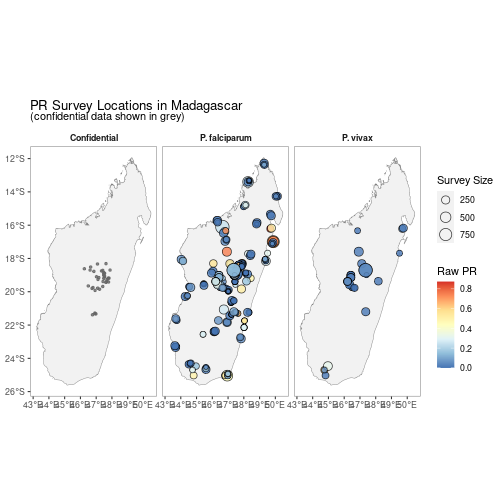
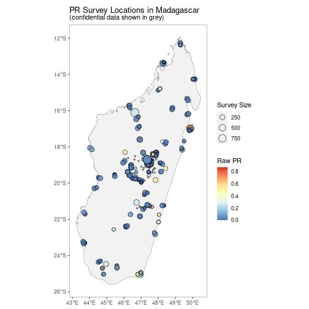
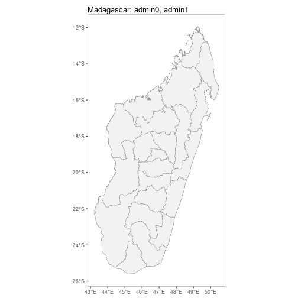
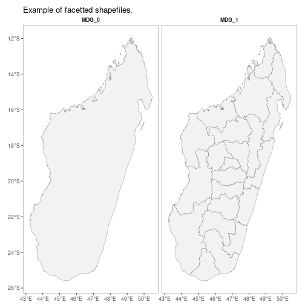

[](https://travis-ci.org/malaria-atlas-project/malariaAtlas)
[](https://codecov.io/gh/malaria-atlas-project/malariaAtlas?branch=master)


# malariaAtlas 
### An R interface to open-access malaria data, hosted by the Malaria Atlas Project. 

*The gitlab version of the malariaAtlas package has some additional bugfixes over the stable CRAN package. If you have any issues, try installing the latest github version. See below for instructions.*

# Overview 

This package allows you to download parasite rate data (*Plasmodium falciparum* and *P. vivax*), survey occurrence data of the 41 dominant malaria vector species, and modelled raster outputs from the [Malaria Atlas Project](https://malariaatlas.org/).

More details and example analyses can be found in the [published paper)[(https://malariajournal.biomedcentral.com/articles/10.1186/s12936-018-2500-5).

## Available Data: 
The data can be explored at [https://malariaatlas.org/explorer/#/explorer](https://malariaatlas.org/explorer/#/explorer).


### list* Functions


`listData()` retrieves a list of available data to download. 

Use: 

* listData(datatype = "pr points") OR listPoints(sourcedata = "pr points") to see for which countries PR survey point data can be downloaded.

* listData(datatype = "vector points") OR listPoints(sourcedata = "vector points") to see for which countries Vector survey data can be downloaded.

* use listData(datatype = "rasters") OR listRaster() to see rasters available to download. 

* use listData(datatype = "shape") OR listShp() to see shapefiles available to download. 


```r
listData(datatype = "pr points")
```

```r
listData(datatype = "vector points")
```

```r
listData(datatype = "raster")
```

```r
listData(datatype = "shape")
```

### is_available

`isAvailable_pr` confirms whether or not PR survey point data is available to download for a specified country. 

Check whether PR data is available for Madagascar:

```r
isAvailable_pr(country = "Madagascar")
```

```
## Confirming availability of PR data for: Madagascar...
```

```
## PR points are available for Madagascar.
```

Check whether PR data is available for the United States of America

```r
isAvailable_pr(ISO = "USA")
```

```
## Confirming availability of PR data for: USA...
```

```
## Specified location not found, see below comments: 
##  
## Data not found for 'USA', did you mean UGA OR SAU?
```

`isAvailable_vec` confirms whether or not vector survey point data is available to download for a specified country. 

Check whether vector data is available for Myanmar:

```r
isAvailable_vec(country = "Myanmar")
```

```
## Confirming availability of Vector data for: Myanmar...
```

```
## Vector points are available for Myanmar.
```

## Downloading & Visualising Data: 
### get* functions & autoplot methods

### Parasite Rate Survey Points
`getPR()` downloads all publicly available PR data points for a specified country and plasmodium species (Pf, Pv or BOTH) and returns this as a dataframe with the following format: 


```r
MDG_pr_data <- getPR(country = "Madagascar", species = "both")
```

```
## Rows: 1,651
## Columns: 28
## $ dhs_id                    <chr> "", "", "", "", "", "", "", "", "", "", "", "", "", "", "", "", "", "", "", "", "", "", "", "",…
## $ site_id                   <int> 6221, 6021, 15070, 15795, 7374, 13099, 9849, 21475, 15943, 7930, 13748, 16323, 19003, 10839, 27…
## $ site_name                 <chr> "Andranomasina", "Andasibe", "Ambohimarina", "Antohobe", "Ambohimazava", "Ankeribe", "Alatsinai…
## $ latitude                  <dbl> -18.7170, -19.8340, -18.7340, -19.7699, -25.0323, -18.7010, -18.7192, -19.5830, -24.9830, -19.7…
## $ longitude                 <dbl> 47.4660, 47.8500, 47.2520, 46.6870, 46.9960, 47.1660, 47.4905, 47.4660, 46.9160, 46.6536, 46.71…
## $ rural_urban               <chr> "UNKNOWN", "UNKNOWN", "UNKNOWN", "UNKNOWN", "UNKNOWN", "UNKNOWN", "UNKNOWN", "UNKNOWN", "UNKNOW…
## $ country                   <chr> "Madagascar", "Madagascar", "Madagascar", "Madagascar", "Madagascar", "Madagascar", "Madagascar…
## $ country_id                <chr> "MDG", "MDG", "MDG", "MDG", "MDG", "MDG", "MDG", "MDG", "MDG", "MDG", "MDG", "MDG", "MDG", "MDG…
## $ continent_id              <chr> "Africa", "Africa", "Africa", "Africa", "Africa", "Africa", "Africa", "Africa", "Africa", "Afri…
## $ month_start               <int> 1, 3, 1, 7, 4, 1, 1, 7, 4, 7, 11, 4, 9, 7, 7, 3, 7, 3, 4, 6, 3, 7, 7, 7, 7, 11, 11, 1, 11, 7, 1…
## $ year_start                <int> 1987, 1987, 1987, 1995, 1986, 1987, 1987, 1995, 1986, 1995, 1997, 1986, 1991, 1995, 1995, 2005,…
## $ month_end                 <int> 1, 3, 1, 8, 6, 1, 1, 8, 4, 8, 11, 6, 9, 8, 8, 6, 7, 3, 6, 6, 6, 7, 8, 8, 8, 11, 11, 1, 11, 8, 1…
## $ year_end                  <int> 1987, 1987, 1987, 1995, 1986, 1987, 1987, 1995, 1986, 1995, 1997, 1986, 1991, 1995, 1995, 2005,…
## $ lower_age                 <dbl> 0, 0, 0, 2, 7, 0, 0, 2, 6, 2, 2, 7, 0, 2, 2, 0, 0, 0, 7, 0, 0, 0, 2, 2, 2, 2, 2, 0, 2, 2, 0, 2,…
## $ upper_age                 <int> 99, 99, 99, 9, 22, 99, 99, 9, 12, 9, 9, 22, 99, 9, 9, 5, 99, 99, 22, 99, 5, 99, 9, 9, 9, 9, 9, …
## $ examined                  <int> 50, 246, 50, 50, 119, 50, 50, 50, 20, 50, 61, 156, 104, 50, 50, 147, 541, 115, 67, 123, 60, 307…
## $ positive                  <dbl> 7.5, 126.0, 2.5, 6.0, 37.0, 13.5, 4.5, 11.5, 8.0, 7.0, 3.0, 97.0, 24.0, 33.0, 0.0, 70.0, 236.0,…
## $ pr                        <dbl> 0.1500, 0.5122, 0.0500, 0.1200, 0.3109, 0.2700, 0.0900, 0.2300, 0.4000, 0.1400, 0.0492, 0.6218,…
## $ species                   <chr> "P. falciparum", "P. falciparum", "P. falciparum", "P. falciparum", "P. falciparum", "P. falcip…
## $ method                    <chr> "Microscopy", "Microscopy", "Microscopy", "Microscopy", "Microscopy", "Microscopy", "Microscopy…
## $ rdt_type                  <chr> "", "", "", "", "", "", "", "", "", "", "", "", "", "", "", "", "", "", "", "", "", "", "", "",…
## $ pcr_type                  <lgl> NA, NA, NA, NA, NA, NA, NA, NA, NA, NA, NA, NA, NA, NA, NA, NA, NA, NA, NA, NA, NA, NA, NA, NA,…
## $ malaria_metrics_available <chr> "true", "true", "true", "true", "true", "true", "true", "true", "true", "true", "true", "true",…
## $ location_available        <chr> "true", "true", "true", "true", "true", "true", "true", "true", "true", "true", "true", "true",…
## $ permissions_info          <chr> "", "", "", "", "", "", "", "", "", "", "", "", "", "", "", "", "", "", "", "", "", "", "", "",…
## $ citation1                 <chr> "Lepers, J.P., Ramanamirija, J.A., Andriamangatiana-Rason, M.D. and Coulanges, P. (1988).  <b>R…
## $ citation2                 <chr> "", "", "", "", "", "", "", "", "", "", "", "", "", "", "", "", "", "", "", "", "", "", "", "",…
## $ citation3                 <lgl> NA, NA, NA, NA, NA, NA, NA, NA, NA, NA, NA, NA, NA, NA, NA, NA, NA, NA, NA, NA, NA, NA, NA, NA,…
```


`autoplot.pr.points` configures autoplot method to enable quick mapping of the locations of downloaded PR points. 


```r
autoplot(MDG_pr_data)
```



A version without facetting is also available.

```r
autoplot(MDG_pr_data,
         facet = FALSE)
```



### Vector Survey Points
`getVecOcc()` downloads all publicly available Vector survey points for a specified country and  and returns this as a dataframe with the following format: 


```r
MMR_vec_data <- getVecOcc(country = "Myanmar")
```

```
## Rows: 2,866
## Columns: 24
## $ site_id        <int> 30243, 30243, 30243, 30243, 1000000072, 1000000071, 1000000071, 1000000072, 1000000071, 1000000071, 100000…
## $ latitude       <dbl> 16.2570, 16.2570, 16.2570, 16.2570, 17.3500, 17.3800, 17.3800, 17.3500, 17.3800, 17.3800, 17.3800, 17.3800…
## $ longitude      <dbl> 97.7250, 97.7250, 97.7250, 97.7250, 96.0410, 96.0370, 96.0370, 96.0410, 96.0370, 96.0370, 96.0370, 96.0370…
## $ country        <chr> "Myanmar", "Myanmar", "Myanmar", "Myanmar", "Myanmar", "Myanmar", "Myanmar", "Myanmar", "Myanmar", "Myanma…
## $ country_id     <chr> "MMR", "MMR", "MMR", "MMR", "MMR", "MMR", "MMR", "MMR", "MMR", "MMR", "MMR", "MMR", "MMR", "MMR", "MMR", "…
## $ continent_id   <chr> "Asia", "Asia", "Asia", "Asia", "Asia", "Asia", "Asia", "Asia", "Asia", "Asia", "Asia", "Asia", "Asia", "A…
## $ month_start    <int> 2, 3, 8, 9, 5, 5, 5, 5, 5, 5, 5, 5, 5, 5, 5, 5, 5, 10, 5, 5, 5, 5, 5, 5, 5, 5, 5, 5, 5, 5, 5, 5, 5, 5, 5, …
## $ year_start     <int> 1998, 1998, 1998, 1998, 1998, 1998, 1998, 1998, 1998, 1998, 1998, 1998, 1998, 1998, 1998, 1998, 1998, 1998…
## $ month_end      <int> 2, 3, 8, 9, 3, 3, 3, 3, 3, 3, 3, 3, 3, 3, 3, 3, 3, 10, 3, 3, 3, 3, 3, 3, 3, 3, 3, 3, 3, 3, 3, 3, 3, 3, 3, …
## $ year_end       <int> 1998, 1998, 1998, 1998, 2000, 2000, 2000, 2000, 2000, 2000, 2000, 2000, 2000, 2000, 2000, 2000, 2000, 1998…
## $ anopheline_id  <int> 17, 17, 17, 17, 50, 49, 17, 51, 11, 4, 15, 1, 35, 30, 50, 51, 30, 17, 17, 11, 15, 1, 35, 49, 4, 17, 11, 15…
## $ species        <chr> "Anopheles dirus species complex", "Anopheles dirus species complex", "Anopheles dirus species complex", "…
## $ species_plain  <chr> "Anopheles dirus", "Anopheles dirus", "Anopheles dirus", "Anopheles dirus", "Anopheles stephensi", "Anophe…
## $ id_method1     <chr> "unknown", "unknown", "unknown", "unknown", "morphology", "morphology", "morphology", "morphology", "morph…
## $ id_method2     <chr> "", "", "", "", "", "", "", "", "", "", "", "", "", "", "", "", "", "", "", "", "", "", "", "", "", "", ""…
## $ sample_method1 <chr> "man biting", "man biting", "man biting", "man biting", "man biting indoors", "man biting indoors", "man b…
## $ sample_method2 <chr> "animal baited net trap", "animal baited net trap", "animal baited net trap", "animal baited net trap", "m…
## $ sample_method3 <chr> "", "", "", "", "animal baited net trap", "animal baited net trap", "animal baited net trap", "animal bait…
## $ sample_method4 <chr> "", "", "", "", "house resting inside", "house resting inside", "house resting inside", "house resting ins…
## $ assi           <chr> "", "", "", "", "", "", "", "", "", "", "", "", "", "", "", "", "", "", "", "", "", "", "", "", "", "", ""…
## $ citation       <chr> "Oo, T.T., Storch, V. and Becker, N. (2003).  <b><i>Anopheles</i> <i>dirus</i> and its role in malaria tra…
## $ geom           <chr> "POINT (16.257 97.725)", "POINT (16.257 97.725)", "POINT (16.257 97.725)", "POINT (16.257 97.725)", "POINT…
## $ time_start     <chr> "1998-02-01", "1998-03-01", "1998-08-01", "1998-09-01", "1998-05-01", "1998-05-01", "1998-05-01", "1998-05…
## $ time_end       <chr> "1998-02-01", "1998-03-01", "1998-08-01", "1998-09-01", "2000-03-01", "2000-03-01", "2000-03-01", "2000-03…
```

`autoplot.vector.points` configures autoplot method to enable quick mapping of the locations of downloaded vector points. 


```r
autoplot(MMR_vec_data)
```


N.B. Facet-wrapped option is also available for species stratification. 

```r
autoplot(MMR_vec_data,
         facet = TRUE)
```


### Shapefiles
`getShp()` downloads a shapefile for a specified country (or countries) and returns this as either a spatialPolygon or data.frame object.


```r
MDG_shp <- getShp(ISO = "MDG", admin_level = c("admin0", "admin1"))
```

```
## Rows: 23
## Columns: 17
## $ iso           <chr> "MDG", "MDG", "MDG", "MDG", "MDG", "MDG", "MDG", "MDG", "MDG", "MDG", "MDG", "MDG", "MDG", "MDG", "MDG", "M…
## $ admn_level    <dbl> 0, 1, 1, 1, 1, 1, 1, 1, 1, 1, 1, 1, 1, 1, 1, 1, 1, 1, 1, 1, 1, 1, 1
## $ name_0        <chr> "Madagascar", "Madagascar", "Madagascar", "Madagascar", "Madagascar", "Madagascar", "Madagascar", "Madagasc…
## $ id_0          <dbl> 10000910, 10000910, 10000910, 10000910, 10000910, 10000910, 10000910, 10000910, 10000910, 10000910, 1000091…
## $ type_0        <chr> "Country", "Country", "Country", "Country", "Country", "Country", "Country", "Country", "Country", "Country…
## $ name_1        <chr> "name_1", "Androy", "Anosy", "Atsimo Andrefana", "Atsimo Atsinanana", "Atsinanana", "Betsiboka", "Boeny", "…
## $ id_1          <chr> "id_1", "10023001", "10023002", "10023003", "10022990", "10023000", "10022994", "10022995", "10022984", "10…
## $ type_1        <chr> "type_1", "Region", "Region", "Region", "Region", "Region", "Region", "Region", "Region", "Region", "Region…
## $ name_2        <chr> "name_2", "name_2", "name_2", "name_2", "name_2", "name_2", "name_2", "name_2", "name_2", "name_2", "name_2…
## $ id_2          <chr> "id_2", "id_2", "id_2", "id_2", "id_2", "id_2", "id_2", "id_2", "id_2", "id_2", "id_2", "id_2", "id_2", "id…
## $ type_2        <chr> "type_2", "type_2", "type_2", "type_2", "type_2", "type_2", "type_2", "type_2", "type_2", "type_2", "type_2…
## $ name_3        <chr> "name_3", "name_3", "name_3", "name_3", "name_3", "name_3", "name_3", "name_3", "name_3", "name_3", "name_3…
## $ id_3          <chr> "id_3", "id_3", "id_3", "id_3", "id_3", "id_3", "id_3", "id_3", "id_3", "id_3", "id_3", "id_3", "id_3", "id…
## $ type_3        <chr> "type_3", "type_3", "type_3", "type_3", "type_3", "type_3", "type_3", "type_3", "type_3", "type_3", "type_3…
## $ source        <chr> "Madagascar NMCP 2016", "Madagascar NMCP 2016", "Madagascar NMCP 2016", "Madagascar NMCP 2016", "Madagascar…
## $ country_level <chr> "MDG_0", "MDG_1", "MDG_1", "MDG_1", "MDG_1", "MDG_1", "MDG_1", "MDG_1", "MDG_1", "MDG_1", "MDG_1", "MDG_1",…
## $ geometry      <MULTIPOLYGON [°]> MULTIPOLYGON (((44.22776 -2..., MULTIPOLYGON (((45.25095 -2..., MULTIPOLYGON (((45.95247 -2..., MULTIPOLYGO…
```

`autoplot.sf` configures autoplot method to enable quick mapping of downloaded shapefiles.


```r
autoplot(MDG_shp)
```



N.B. Facet-wrapped option is also available for species stratification. 


```r
autoplot(MDG_shp,
         facet = TRUE,
         map_title = "Example of facetted shapefiles.")
```



### Modelled Rasters 

`getRaster()`downloads publicly available MAP rasters for a specific surface & year, clipped to a given bounding box or shapefile


```r
MDG_shp <- getShp(ISO = "MDG", admin_level = "admin0")
MDG_PfPR2_10 <- getRaster(surface = "Plasmodium falciparum PR2-10", shp = MDG_shp, year = 2013)
```


`autoplot.SpatRaster` & `autoplot.SpatRasterCollection` configures autoplot method to enable quick mapping of downloaded rasters.


```r
p <- autoplot(MDG_PfPR2_10, shp_df = MDG_shp)
```

```
## Error:
## ! Problem while computing layer data.
## ℹ Error occurred in the 2nd layer.
## Caused by error in `l$layer_data()`:
## ! attempt to apply non-function
```


### Combined visualisation 

By using the above tools along with ggplot, simple comparison figures can be easily produced. 


```r
MDG_shp <- getShp(ISO = "MDG", admin_level = "admin0")
MDG_PfPR2_10 <- getRaster(surface = "Plasmodium falciparum PR2-10", shp = MDG_shp, year = 2013)

p <- autoplot(MDG_PfPR2_10, shp_df = MDG_shp, printed = FALSE)

pr <- getPR(country = c("Madagascar"), species = "Pf")
p[[1]] +
geom_point(data = pr[pr$year_start==2013,], aes(longitude, latitude, fill = positive / examined, size = examined), shape = 21)+
scale_size_continuous(name = "Survey Size")+
 scale_fill_distiller(name = "PfPR", palette = "RdYlBu")+
 ggtitle("Raw PfPR Survey points\n + Modelled PfPR 2-10 in Madagascar in 2013")
```

```
## Error:
## ! Problem while computing layer data.
## ℹ Error occurred in the 2nd layer.
## Caused by error in `l$layer_data()`:
## ! attempt to apply non-function
```

Similarly for vector survey data


```r
MMR_shp <- getShp(ISO = "MMR", admin_level = "admin0")
MMR_An_dirus <- getRaster(surface = "Anopheles dirus species complex", shp = MMR_shp)

p <- autoplot(MMR_An_dirus, shp_df = MMR_shp, printed = FALSE)

vec <- getVecOcc(country = c("Myanmar"), species = "Anopheles dirus")
p[[1]] +
geom_point(data = vec, aes(longitude, latitude, colour = species))+
  scale_colour_manual(values = "black", name = "Vector survey locations")+
 scale_fill_distiller(name = "Predicted distribution of An. dirus complex", palette = "PuBuGn", direction = 1)+
 ggtitle("Vector Survey points\n + The predicted distribution of An. dirus complex")
```

```
## Error:
## ! Problem while computing layer data.
## ℹ Error occurred in the 2nd layer.
## Caused by error in `l$layer_data()`:
## ! attempt to apply non-function
```


## Installation

### Latest stable version from CRAN

Just install using `install.packages("malariaAtlas")` or using the package manager in RStudio.

### Latest version from github

While this version is not as well-tested, it may include additional bugfixes not in the stable CRAN version. Install the `devtools` package and then install using `devtools::install_github('malaria-atlas-project/malariaAtlas')`

## Changes

### 1.2.0

- Removed `rgdal`, `sp`, `raster` packages dependencies and added `terra`, `sf`, `tidyterra`, `lifecycle`
- As a result `getShp` will now return `sf` objects
- Similarly, `getRaster` returns `SpatRaster` or `SpatRasterCollection`
- Some functions have been deprecated. They will still run in this version, with a warning. Please remove them from your code, they will be completely removed in the future.
  - Deprecated `as.MAPraster`, `as.MAPshp`. They are no longer required for working with `autoplot`
  - Deprecated `autoplot_MAPraster`. Use `autoplot` directly with the result of `getRaster`
